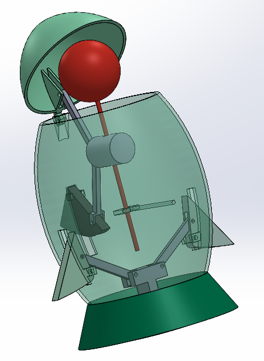

# 🚀 Protector de Chupetín – Diseño Tipo Cohete

## 📌 Descripción

Este proyecto consiste en el diseño de un **protector para bombones tipo chupetín**, inspirado en la forma de un **cohete espacial**.
El objetivo es ofrecer una solución **higiénica, reutilizable y atractiva**, especialmente pensada para niños, combinando funcionalidad con un diseño creativo.

---

## 🎯 Objetivos del diseño

* Proteger el chupetín de la contaminación externa (polvo, suciedad, etc.)
* Facilitar el transporte sin ensuciar superficies
* Crear un diseño atractivo tipo juguete
* Desarrollar un producto reutilizable y fácil de limpiar

---

## 🧠 Concepto

El diseño toma inspiración en la estética de un **cohete**, donde:

* La **punta** funciona como tapa protectora
* El **cuerpo** almacena el chupetín
* La **base** permite soporte y estabilidad

Esto transforma un objeto cotidiano en un producto **lúdico e interactivo**.

---

## 🖼️ Referencias e inspiración
 

---

## 🛠️ Diseño final

---

## ⚙️ Características técnicas

* Diseño ergonómico
* Sistema de apertura/cierre tipo ajuste o rosca *(ajusta según tu diseño)*
* Material sugerido: plástico (PLA, ABS o similar)
* Componentes:

  * Tapa superior (nariz del cohete)
  * Cuerpo principal
  * Base/soporte

---

## 🧩 Proceso de diseño

1. Definición del problema (protección e higiene del chupetín)
2. Generación de ideas (concepto de juguete)
3. Bocetado inicial
4. Modelado 3D
5. Ajustes funcionales y estéticos
6. Renderizado final

---

## 💡 Valor agregado

* Convierte un producto simple en una **experiencia divertida**
* Promueve hábitos de higiene en niños
* Diseño atractivo para mercado infantil
* Potencial de personalización (colores, formas, personajes)

---

## 📂 Archivos incluidos

* Modelos 3D del diseño (Carpeta Modelelo 3D)
* Renderizados (Crapeta Imagenes)

---

## 🚀 Autor

Miguel Hernández
Flavio Ramos

---

## 📎 Notas

Este proyecto es un concepto de diseño 3D con fines académicos/portafolio.
